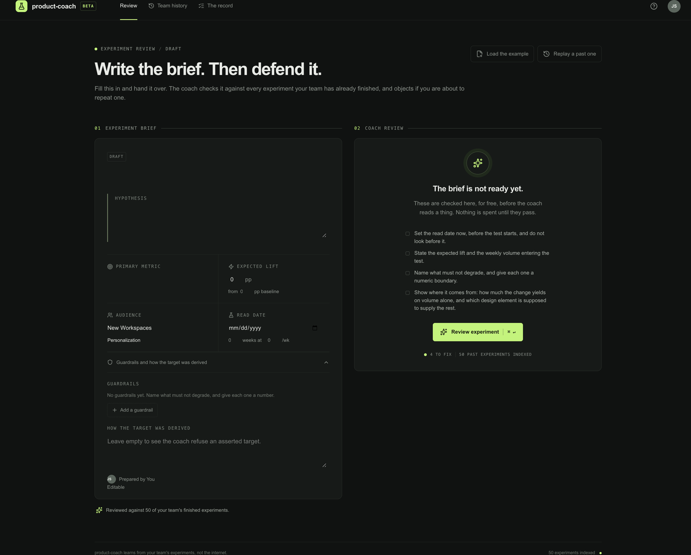
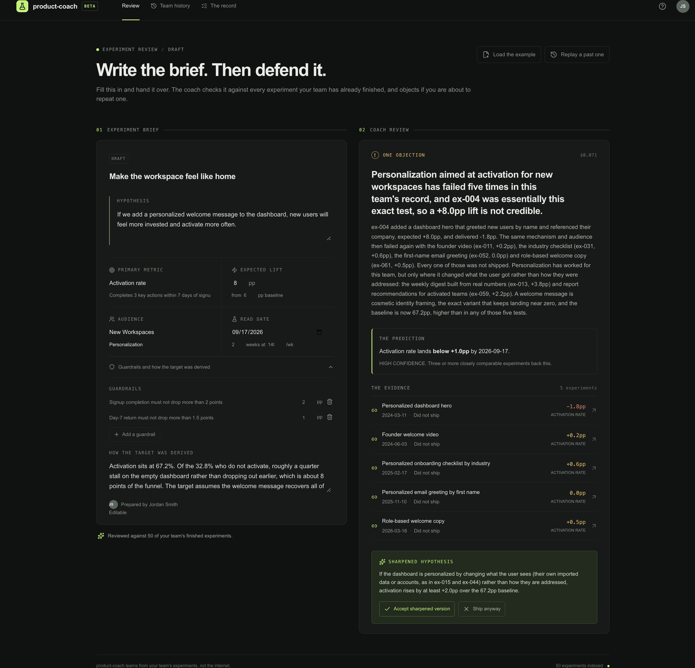

# The Prototype Bet

## What I Built
<!-- One sentence: what does this prototype demonstrate? -->

The review moment: a product manager's draft experiment brief, with the coach objecting beside it, citing the team's own past experiments that made the same assumption and showing how often its own calls of that kind turned out to be right.

## Tool Used
<!-- v0 / Cursor / Lovable / other -->

v0

**Build prompt:**

```
Build me a web app prototype for an AI Copilot product called product-coach.

Who: a product manager about to launch an A/B test, on a team with two years
of past experiments behind them

Core task: challenge a weak experiment hypothesis using the team's own past
results, and show whether its own past challenges turned out to be right

First screen: an experiment brief the PM has drafted, showing the hypothesis,
the metric, the expected lift and the audience, with the coach's review panel
sitting beside it waiting

AI moment: the PM hits Review, and the coach raises one specific objection
grounded in this team's history, citing the past experiments that make the
same assumption and what happened to them

Output: the objection with those past experiments linked, a sharper version of
the hypothesis to accept or reject, and the coach's own track record on this
kind of call: how often it flagged, how often the team shipped anyway, and how
often it was right

Clean UI. Dark theme. One page. No login.
```

The one-shot result needed no correction on content. The usual failure with a prompt like this is generic advice, some version of "have you validated this assumption." What prevented it was specifying the output as evidence with a defined shape: past experiments cited by name, a sharpened hypothesis to accept or reject, and a track record with three named figures. A model asked to fill that shape cannot fill it with a platitude.

**Refinement prompt:**

```
Move the COACH TRACK RECORD block up so it sits directly beneath the
objection headline, above THE EVIDENCE section, instead of at the bottom
of the review panel.

Make it the second most prominent element in that panel after the
objection headline itself: larger figures, more vertical space around it.

Change its framing from the coach's overall record to its record on this
specific kind of call. The label should read "On objections about assumed
causation" with the three figures beneath it.

Keep the same three figures and the same wording everywhere else on the
page. Change nothing else.
```

The refinement fixes a hierarchy problem. The first build put the coach's hit rate at the bottom of the panel in the smallest type on the page. That inverts what matters. The objection is the part a competitor can copy next quarter. The record of whether past objections were right is the part that takes years to accumulate. Credibility should sit next to the claim it supports rather than trailing it as a footnote.

Reframing the figures from an overall record to a record on this kind of call does a second thing. An aggregate hit rate tells a reader how good the coach is in general. A hit rate on objections about assumed causation tells them how much to trust the one on screen.

## Prototype Link
<!-- Paste the shareable URL -->

https://product-coach.vercel.app/

Live and public. Click "Review experiment" to trigger the coach. The Team history tab and the "View all calls" link are navigation stubs. The prototype demonstrates the single review moment rather than the whole product.

### Screenshots

Before the review. The drafted experiment brief on the left, and the coach waiting on the right against 24 indexed past experiments.



After the review, showing the refined layout. One objection, the coach's record on that kind of objection directly beneath it, the three past experiments that support it with their real results, and a sharpened hypothesis to accept or reject.



## AI Value Archetype
<!-- Automator / Copilot / Oracle / Creator / Orchestrator -->

Copilot, moving to Orchestrator later.

Copilot fits what this prototype shows and what the product is at the start. The economics scale with seats rather than with tasks replaced or assets produced. The human stays in the loop by design, because the product's differentiator is that it argues rather than answers.

Creator is the tempting label, since documents come out of it. It is the wrong one. Creator economics are where copies arrive fastest, and that is the ground the incumbent already owns.

The archetype changes once the coach proposes experiments instead of only reviewing them. Reading metrics, suggesting bets, watching results and updating is Orchestrator behaviour. It also brings Orchestrator costs: real infrastructure spend and real autonomy risk. Naming the shift now matters, because the pricing model and the governance burden both change with it.

## The Bet in One Sentence
<!-- What you're building, for whom, why now -->

Product teams will pay for a coach that argues with their decisions using their own data and keeps score on whether it was right.

Why now. Two things became true recently. Agents can read a team's live systems instead of being told about them. And experiment platforms log hypotheses and results well enough that the coach can be graded against a team's own history before anyone buys it. Neither was true two years ago. The second is what makes the scoreboard something you can sell on rather than something you promise.

## Kill Criteria
<!-- When would you stop? What evidence would kill this bet? -->

**The one that kills it.** Run the coach backwards over about fifty of a team's completed experiments. Compare the calls it would have flagged against the ones it would have passed. If the flagged experiments do not underperform the unflagged ones by a clear margin, the coach has no judgment worth selling, and every other part of the strategy depends on it having some.

This test is cheap. It uses data that already sits in the analytics platform, and it can run before any product is built. That is why it goes first.

**The one that kills it slowly.** Objections that get overridden without being read. If teams mute the coach or click past it, nothing accumulates and the scoreboard never fills. The product then degrades into a linter nobody looks at.

The signal to watch is the override rate, split by experience level. A senior manager overriding a bad objection and a new manager ignoring a good one look the same in aggregate, and they mean opposite things.

**The one that forces a re-cut rather than a stop.** A coding agent shipping persistent cross-session product memory, bundled and free. That would not end the bet. The analytics context and the verified record of outcomes stay outside what a model provider can see. It would take the repository half of the context, and the wedge would have to be re-argued around what is left.

**Not a kill criterion.** A competitor copying the review-with-evidence mechanic. That is expected. It is one product decision away for a company that already has the seats. The answer to it is collecting outcomes faster than they do, not keeping the mechanism secret.
