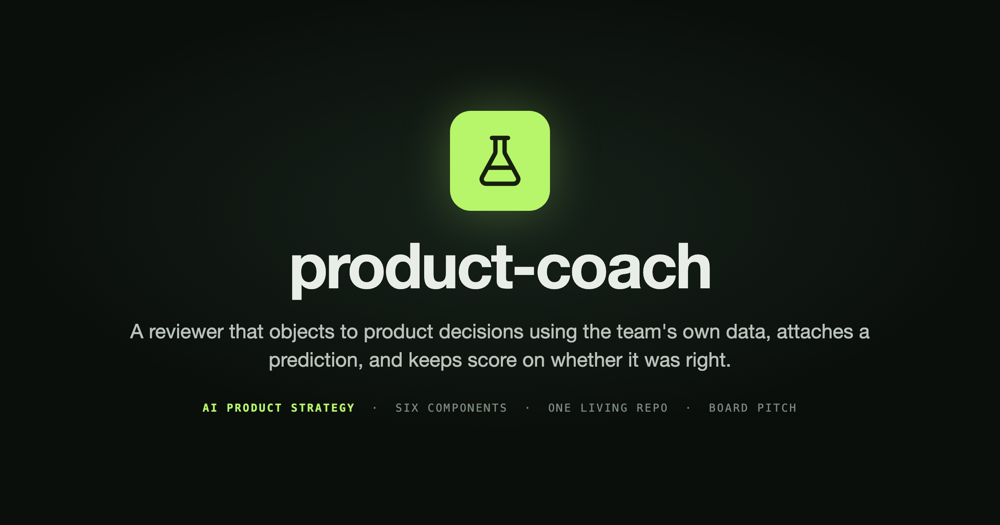

  

#  product-coach: An AI Product Strategy

> **Product teams will pay for a coach that argues with their decisions using their own data and keeps score on whether it was right.**
>
> Engineers get code review. Product managers get nothing. product-coach reads a team's repository, tracker, analytics and customer feedback, objects to a decision using that team's own numbers, attaches a falsifiable prediction to the objection, and records whether it was right when the result comes in. The advice is copyable next quarter. The record of predictions and outcomes is not.

**Prototype:** [product-coach-app.vercel.app](https://product-coach-app.vercel.app/) · **Board pitch:** [antje.github.io/…/final-presentation.html](https://antje.github.io/product-school-ai-product-strategy-for-leaders/final-presentation.html) · **Author:** Antje Barth

---

## Strategy at a Glance

| Component | Module | Status | Key Artifact |
|-----------|--------|--------|-------------|
| **The Bet** | M1 | Done | [`01-the-bet/`](01-the-bet/): vulnerability diagnostic and working prototype |
| **The Moat** | M2 | Done | [`02-the-moat/`](02-the-moat/): data flywheel and kill switch audit |
| **The Margin** | M3 | Done | [`03-the-margin/`](03-the-margin/): cost curve, pricing and board story |
| **The Contract** | M4 | Done | [`04-the-contract/`](04-the-contract/): golden dataset, confidence UX, reliability contract |
| **The Guardrails** | M5 | Done | [`05-the-guardrails/`](05-the-guardrails/): compounding system, governance policy, shadow AI audit |
| **The Pitch** | M6 | Done | [`06-the-pitch/`](06-the-pitch/): three-horizon roadmap, AI evaluation, board pitch, M1 baseline vs now |

---

## The Bet (M1)

**What we're building, for whom, why now.**

- **Product:** product-coach, decision review for product teams. It connects to the repository, tracker, analytics and customer feedback, objects at the brief, PRD or roadmap stage using the team's own numbers, and records whether its own call was right when the read-out arrives. Every read-out is graded by the quality of its counterfactual, so a flag rollout counts without pretending to be a controlled test.
- **Why Now:** Agents can read a team's live systems instead of being told about them, and experimentation platforms log hypotheses and results well enough that the coach can be graded on a buyer's own history before they buy. Neither was true two years ago. The window is a year: the platforms could add native review inside that, and a record of outcomes cannot be backfilled after the fact.
- **AI Value Archetype:** Copilot, with an Orchestrator trajectory once it proposes experiments instead of only reviewing them.
- **Vulnerability Scores:** Moat 4/5 · Data 4/5 · Platform 2/5. The moat score is the design's ceiling; realized today, with a 9/20 flywheel and no loop compounding, it is nearer 2 and rises with the record on the dates the roadmap names.
- **Top Risk:** The product is sold on keeping score, so if the coach's calls do not beat the team's own judgment, it will have collected the evidence against itself and published it.
- **Confidence:** M. The demand is proven, ChatPRD sells AI coaching to product managers at $15 a seat. The wedge is not: nothing yet shows the coach's calls beat the team's own.
- **Prototype:** [product-coach-app.vercel.app](https://product-coach-app.vercel.app/)

- **Kill Criteria:** A pre-registered backtest over the completed experiments of two or three named design partners, pooled: flagged experiments must succeed at least 20 points less often than unflagged, the coach seeing only the brief with history cut at its date, within eight weeks of the first connecting. Pooled because one partner's twelve flags carry a ±27-point interval and three partners' thirty-six carry about ±16, so a single partner is a signal and the pool is the verdict. A lower-trust mode scores an anonymised export offline for partners who will not grant live access before proof. It is also the entry gate: no subscription starts until a team's own backtest passes, so the kill decision precedes the spend on both sides.

→ Details: [`diagnostic.md`](01-the-bet/diagnostic.md) · [`prototype.md`](01-the-bet/prototype.md)

---

## The Moat (M2)

**Why this won't get copied in 6 months.**

- **Data Flywheel Score:** 9/20 (Correction 4 · Preference 2 · Domain Context 1 · Network 2)
- **Weakest Loop:** Domain Context, at 1 today because the record holds only controlled experiments. It widens by attribution grade, not by decision type: staged rollouts and flagged releases enter the record as grade B, weighted below controlled tests and above nothing, which grows the scorable surface about tenfold without diluting the hit rate.
- **Competitive Position:** ChatPRD scores 8/20 on the same loops, so the category has no flywheel. The whole difference is the Correction loop: their corrections say a user changed the wording, these say the user was wrong.
- **Encroachment Defense:** The most dangerous attacker is the experimentation platforms, because they could add a review step inside their own experiment flow within a year. The coach therefore sits upstream of them, at the brief and roadmap stage, and reads from all of them. That surface belongs to Atlassian, Linear and Notion, who see the decision and never the outcome, as the platforms see the outcome and never the decision. The product is the join, and the record of decision against outcome is what only the join can build.
- **Vendor Portability:** Partial. Eval is strong because the product already scores its own advice, so the usual blocker is solved. Provider, abstraction and routing are all High risk and about two weeks of ordinary work away.

→ Details: [`data-flywheel.md`](02-the-moat/data-flywheel.md) · [`kill-switch.md`](02-the-moat/kill-switch.md)

---

## The Margin (M3)

**Will this make money or bleed it?**

- **Gross Margin (floor):** 74.3% at the rejected $30-per-seat price, shown as the worst case. COGS is $7.72 per seat per month, $463 per five-seat team per year, and 65% of it is human onboarding, not inference.
- **Gross Margin (proposed pricing):** 94.9% in year one, 97.8% by year three once onboarding is self-serve. Inference is $116 of the $463, so revenue per inference dollar is about 78x.
- **Pricing Model:** Hybrid. $500 per team per month plus $60 per experiment reviewed, so $9,000 in year one. Year one is a founder-led design-partner program of three to five teams, onboarded by hand under data-use terms that seed the pooled layer; self-serve from year two. Every subscription starts only when the team's own backtest passes. Outcome units were rejected because a resolved call would let the vendor decide the invoice, and because any unit tied to warnings shrinks as the coach teaches the team to stop repeating itself.
- **Cascading Strategy:** 96% of requests to small models and embeddings, 4% to mid and frontier. The volume is the daily-help surface, about 88 assists per seat per month, given away to build the habit; the priced review is the 4%. A task moves up a tier only when a smaller model actually fails at it and being wrong costs something. Worth 19.5 points of gross margin.
- **Customer ROI:** About $60,000 a year of avoidable experiment spend against $9,000 paid, roughly 6.7x, derived from the backtest parameters: 12 of 50 flagged, failing 20 points more often, at $25,000 each, if the team acts on the flag. Earned or lost by the same test as the kill criterion.
- **Break-even at:** Contribution is $8,537 per team per year, so the platform ($20 Vercel, $19 Neon a month) is covered by the first team. The model carries no salary, so real break-even is loaded founder cost divided by $8,537, and that number is what the ask has to fund. A review costs 0.7% of the $25,000 experiment it checks; year-one CAC is founder time, and from year two self-serve payback is 1.7 months against 28.7 at seat pricing with a rep.

→ Details: [`cost-curve.md`](03-the-margin/cost-curve.md)

---

## The Contract (M4)

**Why users will trust a probabilistic system.**

- **Reliability Target:** Accuracy 90% (alert <85%), hallucination <1% (alert >2%), latency p95 <20s, drift <5pp per 4 weeks. Measured weekly against the golden set, segmented by prompt version, model and call type. Accuracy proves consistency against a corpus we built; the commercial claim that predictions beat a team's own judgment needs a customer's real history and is not asserted.
- **Golden Dataset:** 10 rows today, 300 at v1, 4 adversarial and 6 edge cases. At 10 rows a 90% measurement carries ±18.6 points, so the contract is not enforceable until the set grows. The path to 300 is corpus rows, reworded variants, refusal cases and the first three customer backtests.
- **Confidence UX:** Four outcomes, not one answer. Refuse before any model call on an unreviewable brief, Object when history contradicts, Endorse on named positive precedent, Decline when history is silent. Below 90% confidence an endorsement degrades to Decline, because encouragement costs more to get wrong than caution does.

- **HITL Architecture:** A human is reached only on a fabricated citation or an endorsement whose precedents disagree. Refusals and declines never escalate, so review volume tracks failures, not usage, and the queue shrinks as the corpus grows.
- **Failure Mode Coverage:** Four coverage gaps named, and one real failure kept, not fixed. The live coach misread ex-044's mechanism from its prose and was wrong by 9.2pp. Softening the corpus to hide it would be the self-grading failure the product exists to avoid.

→ Details: [`golden-dataset.md`](04-the-contract/golden-dataset.md)

---

## The Guardrails (M5)

**What breaks when this scales, and what compounds.**

- **Freeze Test:** Frozen for a quarter with every competitor on the same model, product-coach is the only asset in the comparison that grows. Templates, content breadth and in-experiment optimization all go static. A verified record of predictions and outcomes cannot be bought, scraped or generated, because it requires having been present at the decision, the override and the read-out.
- **Compounding System:** Three loops, none compounding today, for three different reasons. Recursive Learning is the one defect: the product records every override and resolves every prediction, then never returns the record to the reasoning. Cross-Domain Transfer is designed and unfed: attribution grading lets rollouts enter the record, and the first grade B outcome arrives with the first design partner releasing behind flags. Network Intelligence is gated on those partners' data-use terms. Six design commitments follow, the first being that the record is the product and the advice is how we earn the right to keep it.
- **Governance Posture:** The coach argues, it never acts, and holds no write path into any customer system. Two decisions need human approval: scoring a prediction when the read-out is ambiguous, defined as the 95% CI containing the objection's threshold, and shipping any prompt or model change, gated at 90% golden-set pass and 1% hallucinated citations. `decline-only` is the named degraded state, entered automatically on a fabricated citation or a 10-point pass-rate drop.
- **Shadow AI Status:** 6 workarounds found, triaged to 4 build, 1 partner, 1 ignore. $35 per PM per month in adjacent spend. Dominant signal is trust, which reframes the audit: users double-checking output against another model are reporting a credibility problem, not requesting a feature.
- **Agent Boundaries:** Four components, three of which call a model, plus one designed and unbuilt. Each row separates what code enforces from what policy merely asks, because a reader cannot otherwise tell which limits survive a bug. No component calls another's tools and there is no chain, so there is no handoff to own.
- **Regulatory Exposure:** EU AI Act limited risk, conditionally. It holds only while a person's coaching profile stays private to that person; exposing it upward is Annex III performance monitoring and moves the product to high risk. The decision is to keep it private, which costs the per-person visibility that was one reason a leader would buy, and keeps the team-level decision record that carries the renewal.

→ Details: [`05-the-guardrails/`](05-the-guardrails/)

---

## The Pitch (M6)

**How you get this funded, shipped, and adopted.**

- **Horizon 1 (Now):** Four weeks, nine items, everything that gates the backtest: the first partner's analytics connector, the craft/context schema split, override capture and read-out delivery with their loop metrics, attribution grading, data-use and retention terms, golden set to 100 with a calibration check, and the customer ROI one-liner.
- **Horizon 2 (Next):** One to three months, eleven items with kill criteria: the pre-registered backtest (stop if the pooled gap across partners is under 20 points by week 8), ten buyer conversations (reprice if fewer than 3 of 10 say yes by week 4), three to five design partners, the Recursive Learning return path, the cascade, the CI gate and `decline-only`, record prominence, the PII screen, provider abstraction, record export.
- **Horizon 3 (Bet):** Three to six months, four items each with a precondition: the pooled cold-start layer, which is the one to protect if budget is cut; self-serve onboarding in year two; the monitoring add-on only after the backtest passes; the private person layer only once never-upward is enforced in code.
- **Board Narrative:** Product teams will pay for a reviewer that objects to their decisions before they ship and keeps score on whether it was right, because a verified record of calls and outcomes is the one asset neither a foundation model nor an experimentation platform can ship as a feature. Why now: agents can read live systems and platforms log outcomes well enough to grade the coach on a buyer's own history before the sale. Defensible: the record, upstream of the platforms, with pooled priors sequenced first. Economics: $9,000 per team at 94.9% gross margin. Risks: the backtest kills it before spend if the coach is not better than the team.
- **Ask:** $275,000 for twelve months: one founder full-time at a modelled $250,000 loaded cost, plus $25,000 for counsel on data-use terms and platform, funding a three-to-five-team design-partner program. Break-even is 30 teams. The backtest result is published by month three either way, and the kill point is week eight after the first partner connects.
- **Where this goes:** A new team's first objection is already better than a general model's because it carries what every other team's record taught, the backtest runs without anyone from us in the room, and the coach proposes the next experiment instead of only reviewing the one in front of it.
- **Key Strategic Change:** The intervention point moved upstream of the experimentation platforms, to the moment a decision is written down, and read-outs are graded by attribution quality so flag rollouts count. The platforms went from the most dangerous attacker to the read-out sources the product sits above. Year one became a design-partner program gated on a pre-registered backtest.
- **AI Metrics for the Board:** Hallucination <1% (alert >2%). Drift <5pp per four weeks. HITL rate <2% of reviews, since a human is reached only on a fabricated citation or disagreeing endorsement precedents. Inference ROI about 78x, $116 of inference per $9,000 of revenue. Eval regression: zero shipped, because a release is blocked below 90% golden-set pass; measured as the pass-rate delta per release. Confidence distribution is reported from the ledger by tier (>90%, 70 to 90%, declined below 70%) and not targeted, because a target would push the coach to game its own confidence.

→ Details: [`roadmap.md`](06-the-pitch/roadmap.md) · [`final-presentation.html`](final-presentation.html), [live](https://antje.github.io/product-school-ai-product-strategy-for-leaders/final-presentation.html)

---

A living strategy built across six sessions of AI Product Strategy for Leaders, Product School. One component per module; the repo is the deliverable.
